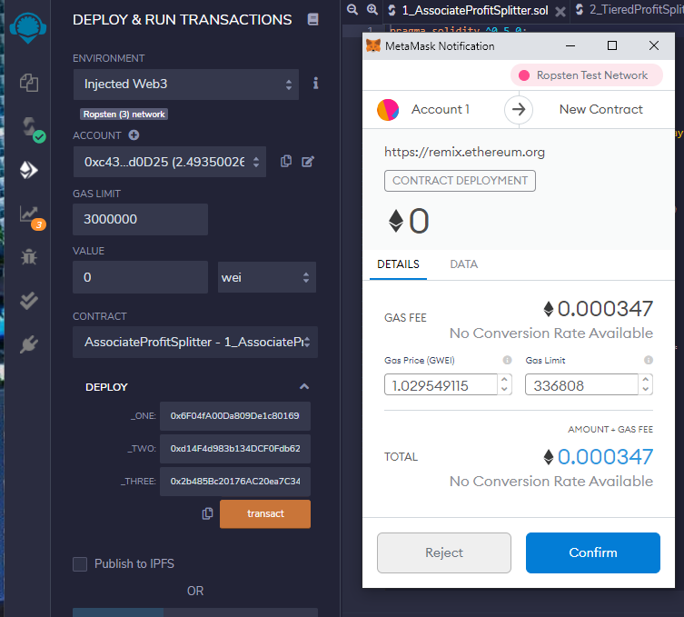
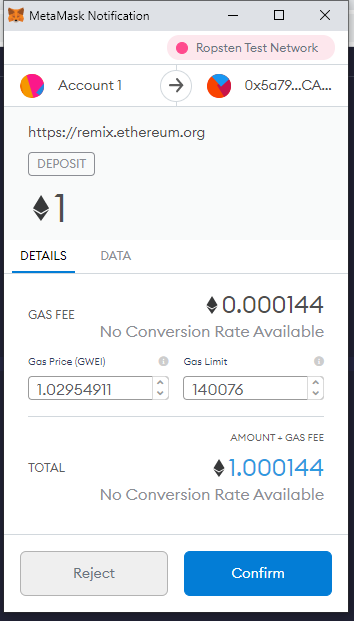
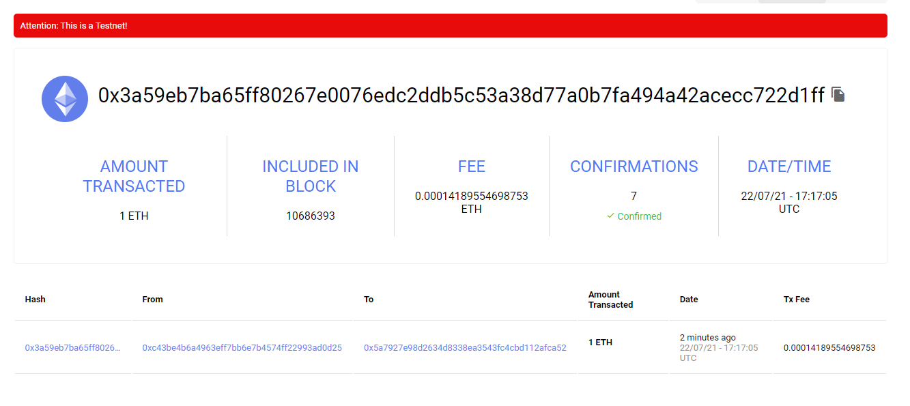
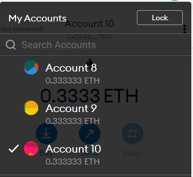
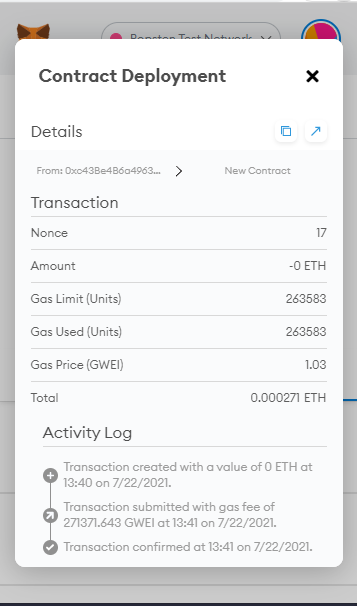
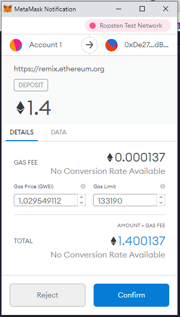
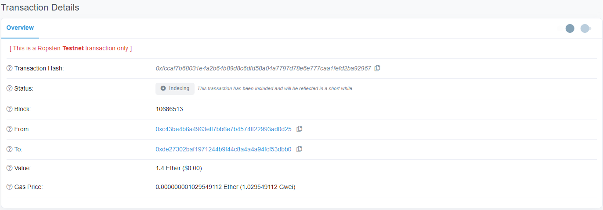
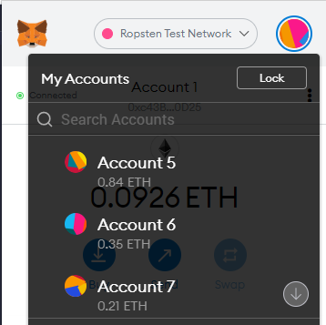

# Looks like we have made our First Contract!

### 1_AssociatedProfitSplitter.sol
We created a smart contract that splits the msg.value equally to 3 predefined addresses and returns any change to msg.sender.  

1.  Deployed Smart Contract 0x5a7927E98D2634d8338ea3543FC4Cbd112aFCA52

    Deposits are split equally amongst these addresses
    - _ONE        0x6F04fA00Da809De1c80169b6dcAD70221Ec5f67f 
    - _TWO        0xd14F4d983b134DCF0Fdb622d96B193E6B3FA3050
    - _THREE      0x2b485Bc20176AC20ea7C346AD2afA8C517fc7895

    

2.  Deposited 1.00 ETH to smart contract 0x5a7927E98D2634d8338ea3543FC4Cbd112aFCA52

    

3.  Confirmed deposit on Ropsten 

    

4.  Check balances of _ONE, _TWO, and _THREE

    

### 2_TieredProfitSplitter.sol
In this smart contract example we split the msg.value unevenly amongst different employees using basis points.

1.  Deployed Smart Contract 0xDe27302BaF1971244B9F44c8A4a4a94FCf53dBb0

    Deposits are split equally amongst these addresses
    - _ONE        0x3662553f4A22442D74D460dCd55351DbfB53066A
    - _TWO        0x53883486565dA721b82c39f756848Aa35BEeD507
    - _THREE      0x82525fA6C97e1049D72F46e0BED7ac2eDA0f057E

    

2.  Deposited 1.40 ETH to smart contract 0xDe27302BaF1971244B9F44c8A4a4a94FCf53dBb0

    

3.  Confirmed deposit on Ropsten 

    

4.  Check balances of _ONE, _TWO, and _THREE

    

### 3_DeferredEquityPlan.sol
In this smart contract we keep track of employees stock incentive plan and use date to insure the employee is distributed annually.

